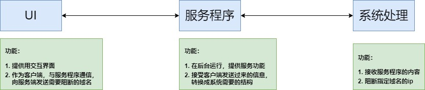
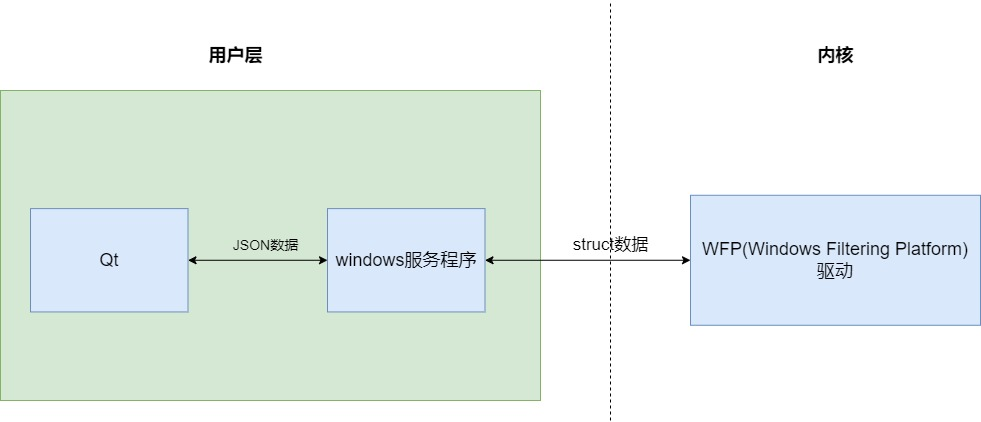
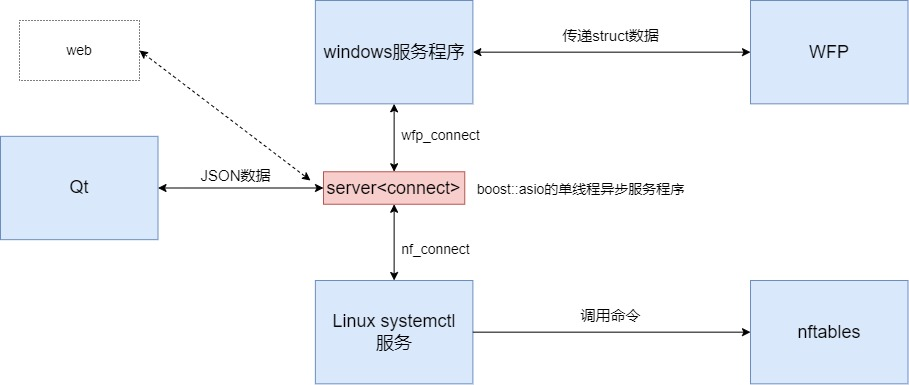

## 总体设计

跨平台总体设计



windows端总体设计



linux端总体设计


代码详细设计



## json数据格式

```json
{
    "name": "dacao",
    "description": "Block the following networks",
    "rules": [
        {
            "action": "block",
            "domain": "www.baidu.com",
            "ip": [
                "180.101.50.188",
                "180.101.50.242"
            ]
        }
    ]
}
```

## 开发文档

1. 首先考虑核心部分的构建，即如何阻断网络。我们先看下windows上的实现方案之一。windows上可以选用WFP(Windows Filtering Platform)，进行网络阻断。它需要写成驱动加载到内核，所以得学习下windows驱动编程。相关文档见：
    * [windows驱动开发环境搭建以及helloworld](https://blog.csdn.net/sinat_38816924/article/details/127933589)
    * [windows内核编程-文件操作](https://blog.csdn.net/sinat_38816924/article/details/128159702)
    * [windows驱动编程-应用与内核通信](https://blog.csdn.net/sinat_38816924/article/details/128341319)
    * [windows驱动开发-WDF编程](https://blog.csdn.net/sinat_38816924/article/details/128636594)
    * [WFP网络过滤驱动-限制网站访问](https://blog.csdn.net/sinat_38816924/article/details/129178452)

2. 接下来，我们在考虑如何在Linux上阻断网络。这里选用的是`nftables`。`nftables`的简单使用见：[iptables和nftables的使用](https://blog.csdn.net/sinat_38816924/article/details/129001218)

3. 如果使用WFP用户层接口，需要在用户层维护一个handle。因此，需要一个服务程序。windows上使用[windows服务编程](https://blog.csdn.net/sinat_38816924/article/details/129229624)。

4. linux上，我最开始打算使用守护进程，也列了下[禁止程序重复启动的一些方法](https://blog.csdn.net/sinat_38816924/article/details/129272271)。后来选用`systemctl`管理服务。关于服务设置，我简单整理了下：[linux-windows服务设置-小结](https://blog.csdn.net/sinat_38816924/article/details/126563564)

5. 为了使用UI程序可以和服务程序通信，还需要一个server程序。所以，参考`boost::asio`的示例，简单实现一个[单线程异步的socket服务程序](https://blog.csdn.net/sinat_38816924/article/details/129339220)

6. 由于代码在windows/linux上的不同IDE中开发，使用clang-format进行代码风格管理：[C++代码格式化-clang-format](https://blog.csdn.net/sinat_38816924/article/details/129469086)

7. 至于UI界面，选用qt和web都行。或者，UI代码在其他机器上运行都可以。这是进程间使用socket通信带来的好处。这里，使用qt，创建一个可以与用户交互的客户端程序。

## 编译与打包

### linux平台

```shell
mkdir build && cd build
cmake ..
make package
```

### windwos平台

windows下面的打包有点麻烦。

* qt程序没有打包成安装包，通过脚本执行windeployqt，生成一个免安装版本。

* 驱动程序，没有接入cmake管理，得使用vs打开进行编译。

* 上面程序编译通过后，使用inno setup进行打包

```shell
mkdir build && cd build
cmake  -G "Visual Studio 16 2019" -A x64 ..
cmake --build . --config Release

# 生成windows的qt免安装包
## 进入项目的\package\windows目录，运行
### 输出qt程序在ui-output目录
python .\ui.py

# 生成驱动
## 进入项目的windows\WFP\block目录，使用visiual studio打开项目
### 进行编译

## 当上面编译完成后
### 使用inno setup，打开\package\windows\service.iss
### 输出安装包在service-output目录
```